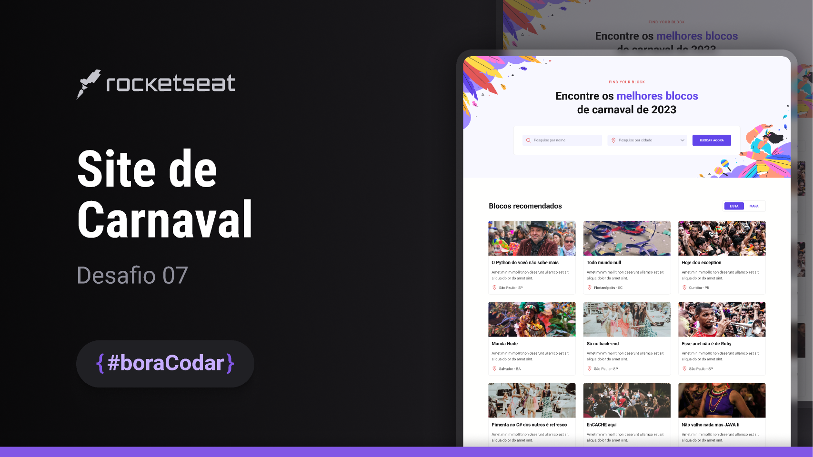

## View project running 
  
      
 
# #BoraCodar

  

:rocket:	Application of a Product Card developed in HTML ,CSS and Javascript. See the Project on Figma [here](https://www.figma.com/community/file/1207675804423978995) :rocket:	  

 

## Programming languages and tools
 

  
  
  <a href="https://github.com/">
  

